# 🚀 AI 预制件模板 (Prefab Template)

[](https://github.com/your-org/prefab-template/actions)
[](https://opensource.org/licenses/MIT)
[](https://www.python.org/downloads/)
[](https://github.com/astral-sh/uv)
[](https://flake8.pycqa.org/)

> **这是一个标准化的预制件模板仓库，用于为 AI 编码平台创建可复用的高质量代码模块。**

## 📋 目录

- [什么是预制件？](#什么是预制件)
- [快速开始](#快速开始)
- [项目结构](#项目结构)
- [开发指南](#开发指南)
- [测试与验证](#测试与验证)
- [发布流程](#发布流程)
- [示例预制件](#示例预制件)
- [常见问题](#常见问题)

**📚 更多文档**: [AI助手开发指南](AGENTS.md) | [贡献指南](CONTRIBUTING.md)

## 什么是预制件？

预制件 (Prefab) 是一个可被 AI 直接调用的、经过标准化打包的 Python 代码模块。它解决了 AI 在处理复杂业务逻辑时能力不足的问题，通过社区贡献的方式为平台提供高质量、可复用的代码组件。

### 核心特性

- ✅ **标准化结构**: 统一的文件组织和配置规范
- 🤖 **AI 友好**: 明确的函数签名和元数据描述
- 🚀 **自动化 CI/CD**: 一键测试、打包、发布
- 📦 **依赖管理**: 自动打包运行时依赖
- 🔒 **质量保证**: 强制性的代码检查和测试
- 🔐 **密钥管理**: 完善的 secrets 支持

## 快速开始

### 1. 使用此模板创建新仓库

点击 GitHub 上的 "Use this template" 按钮，或者克隆此仓库：

```bash
git clone https://github.com/your-org/prefab-template.git my-prefab
cd my-prefab
```

### 2. 安装开发依赖

使用现代化的 [uv](https://github.com/astral-sh/uv) 工具：

```bash
# 安装 uv（如果尚未安装）
# Windows: powershell -ExecutionPolicy ByPass -c "irm https://astral.sh/uv/install.ps1 | iex"
# macOS/Linux: curl -LsSf https://astral.sh/uv/install.sh | sh

# 同步依赖（自动创建虚拟环境）
uv sync --dev
```

### 3. 安装 Git Hooks（强烈推荐）

安装 pre-commit hooks 后，每次提交代码前会自动运行质量检查，避免提交有问题的代码：

```bash
# 安装 pre-commit hooks
uv run pre-commit install

# 🎉 现在每次 git commit 都会自动检查代码质量！
```

**自动检查项目：**
- ✅ Flake8 代码风格（防止 F401 等常见错误）
- ✅ isort 导入排序
- ✅ Manifest 验证
- ✅ 单元测试
- ✅ 版本同步检查

### 4. 编写你的预制件

1. **编辑 `src/main.py`**: 在这里编写你的核心业务逻辑
2. **更新 `prefab-manifest.json`**: 描述你的函数签名和元数据
3. **编写测试**: 在 `tests/test_main.py` 中添加单元测试

### 5. 本地测试

```bash
# 运行测试
uv run pytest tests/ -v

# 代码风格检查
uv run flake8 src/ --max-line-length=120

# 验证 manifest 一致性
uv run python scripts/validate_manifest.py

# 一键运行所有验证
uv run python scripts/quick_start.py
```

### 6. 发布预制件

```bash
# 方式一: 使用版本升级脚本（推荐）
uv run python scripts/version_bump.py patch  # 1.0.0 -> 1.0.1
# 或
uv run python scripts/version_bump.py minor  # 1.0.0 -> 1.1.0
# 或
uv run python scripts/version_bump.py major  # 1.0.0 -> 2.0.0

# 然后提交并推送
git add .
git commit -m "Bump version to x.x.x"
git tag vx.x.x
git push origin vx.x.x

# 方式二: 手动更新
# 1. 手动编辑 prefab-manifest.json 和 pyproject.toml 中的 version（必须保持一致）
# 2. git tag v1.0.0
# 3. git push origin v1.0.0
```

🎉 GitHub Actions 将自动完成测试、打包（生成 .whl 格式）和发布！

## 项目结构

```
prefab-template/
├── .github/
│   └── workflows/
│       └── build-and-release.yml    # CI/CD 自动化流程
├── data/                            # 数据文件目录
│   ├── inputs/                      # 输入文件目录（开发/测试时使用）
│   └── outputs/                     # 输出文件目录（开发/测试时使用）
├── src/
│   └── main.py                      # 预制件核心代码（必须）
├── tests/
│   └── test_main.py                 # 单元测试
├── scripts/
│   └── validate_manifest.py         # Manifest 验证脚本
├── prefab-manifest.json             # 预制件元数据（必须）
├── pyproject.toml                   # 项目配置和依赖
├── .gitignore                       # Git 忽略文件
├── LICENSE                          # 开源许可证
└── README.md                        # 项目文档
```

## 开发指南

### `src/main.py` - 核心业务逻辑

这是你的预制件的唯一入口文件。所有暴露给 AI 的函数都必须在此文件中定义。

**示例函数：**

```python
def analyze_dataset(data: list, operation: str = "statistics") -> dict:
    """
    分析数据集并返回统计结果

    Args:
        data: 数字列表
        operation: 操作类型 ("statistics", "sum", "average")

    Returns:
        包含分析结果的字典
    """
    try:
        if not data:
            return {
                "success": False,
                "error": "数据集不能为空",
                "error_code": "EMPTY_DATA"
            }

        if operation == "statistics":
            stats = calculate_statistics(data)
            return {
                "success": True,
                "data": {
                    "operation": "statistics",
                    "statistics": stats
                }
            }
        # ... 其他操作类型
    except Exception as e:
        return {
            "success": False,
            "error": str(e),
            "error_code": "UNEXPECTED_ERROR"
        }
```

**编码规范：**

- ✅ 使用类型提示 (Type Hints)
- ✅ 编写清晰的 Docstring
- ✅ 返回结构化的数据（通常是字典）
- ✅ 包含错误处理
- ❌ 避免使用全局状态
- ❌ 不要在模块级别执行副作用操作

### `prefab-manifest.json` - 元数据描述

这是 AI 理解如何调用你的预制件的"API 契约"。**必须**与 `src/main.py` 中的函数签名保持一致。

**字段说明：**

```json
{
  "schema_version": "1.0",           // 清单模式版本（固定）
  "id": "hello-world-prefab",        // 全局唯一的预制件 ID
  "version": "1.0.0",                // 语义化版本号（与 pyproject.toml 和 Git Tag 一致）
  "name": "预制件名称",              // 可读的预制件名称
  "description": "预制件功能描述",    // 详细功能说明
  "tags": ["tag1", "tag2"],          // 标签列表，用于分类和搜索
  "entry_point": "src/main.py",      // 入口文件（固定）
  "dependencies_file": "pyproject.toml",  // 依赖文件（固定）
  "functions": [                     // 函数列表
    {
      "name": "analyze_dataset",     // 函数名（必须与代码一致）
      "description": "分析数据集并返回统计结果",  // 功能描述
      "parameters": [                // 参数列表
        {
          "name": "data",
          "type": "array",           // 使用 JSON Schema 类型名
          "description": "数字列表",
          "required": true
        },
        {
          "name": "operation",
          "type": "string",          // 使用 JSON Schema 类型名
          "description": "操作类型：'statistics', 'sum', 'average'",
          "required": false,
          "default": "statistics"
        }
      ],
      "returns": {                   // 返回值描述（结构化 schema）
        "type": "object",
        "description": "返回结果对象",
        "properties": {
          "success": {
            "type": "boolean",
            "description": "操作是否成功"
          },
          "data": {
            "type": "object",
            "description": "成功时的结果数据",
            "optional": true
          },
          "error": {
            "type": "string",
            "description": "错误信息",
            "optional": true
          },
          "error_code": {
            "type": "string",
            "description": "错误代码",
            "optional": true
          }
        }
      }
    }
  ],
  "execution_environment": {         // 执行环境配置（可选）
    "cpu": "1",                      // CPU 核心数
    "memory": "512Mi"                // 内存大小
  }
}
```

**支持的类型：**

*基础类型（对应 JSON Schema）：*
- `string` - 字符串
- `number` - 数字（整数或浮点数）
- `integer` - 整数
- `boolean` - 布尔值
- `object` - 对象/字典
- `array` - 数组/列表

*平台感知类型（用于文件处理）：*
- `InputFile` - 输入文件
- `OutputFile` - 输出文件

### 文件处理指南

当你的预制件需要处理文件（如图片、视频、文档等）时，需要使用**固定的文件路径约定**。平台会自动将用户上传的文件放置到指定目录，并在函数执行完成后收集输出文件。

#### 路径约定（重要！）

**输入文件路径规则：**
```
data/inputs/{files中的key名称}/
```

**输出文件路径规则：**
```
data/outputs/
```

#### Manifest 配置示例

如果你的函数需要接收文件输入，在 `prefab-manifest.json` 中这样声明：

```json
{
  "functions": [{
    "name": "process_video",
    "description": "处理视频文件",
    "parameters": [],
    "files": {
      "input": {
        "type": "InputFile",
        "description": "需要处理的视频文件",
        "required": true,
        "accept": ".mp4,.avi,.mov"
      }
    },
    "returns": {
      "type": "object",
      "description": "处理结果"
    }
  }]
}
```

**关键点：**
- `files` 字段中的 key（如 `"input"`）决定了输入文件的路径
- `type: "InputFile"` 表示这是输入文件
- `accept` 可选，用于限制文件类型

#### 代码实现示例

```python
from pathlib import Path

def process_video() -> dict:
    """处理视频文件"""
    # 固定路径：data/inputs/{key}/
    # 这里的 "input" 对应 manifest 中 files.input 的 key
    DATA_INPUTS = Path("data/inputs/input")
    DATA_OUTPUTS = Path("data/outputs")

    # 确保输出目录存在
    DATA_OUTPUTS.mkdir(parents=True, exist_ok=True)

    try:
        # 扫描输入文件（平台会自动将文件放到这里）
        input_files = list(DATA_INPUTS.glob("*"))

        if not input_files:
            return {
                "success": False,
                "error": "未找到输入文件",
                "error_code": "NO_INPUT_FILES"
            }

        # 处理第一个文件
        input_file = input_files[0]
        print(f"处理文件: {input_file}")

        # 执行你的业务逻辑...
        # result = do_something(input_file)

        # 将输出文件保存到固定路径（平台会自动收集）
        output_file = DATA_OUTPUTS / "output.mp4"
        # save_result(output_file)

        return {
            "success": True,
            "data": {
                "processed_file": str(output_file.name),
                "input_file": str(input_file.name)
            }
        }
    except Exception as e:
        return {
            "success": False,
            "error": str(e),
            "error_code": "PROCESSING_ERROR"
        }
```

#### 常见错误与注意事项

**❌ 错误示例：缺少 key**
```python
# 这样会找不到文件！
DATA_INPUTS = Path("data/inputs")  # 缺少 manifest 中定义的 key
```

**✅ 正确示例：包含完整路径**
```python
# 如果 manifest 中是 files.input
DATA_INPUTS = Path("data/inputs/input")

# 如果 manifest 中是 files.video
DATA_INPUTS = Path("data/inputs/video")

# 如果 manifest 中是 files.document
DATA_INPUTS = Path("data/inputs/document")
```

**路径匹配规则：**
- Manifest 中的 `files.{key}` → 代码中的 `data/inputs/{key}/`
- `files.input` → `data/inputs/input/`
- `files.video` → `data/inputs/video/`
- `files.images` → `data/inputs/images/`

**多文件输入：**
如果需要接收多个文件，在 manifest 中定义多个 key：

```json
{
  "files": {
    "video": {
      "type": "InputFile",
      "description": "视频文件"
    },
    "subtitle": {
      "type": "InputFile",
      "description": "字幕文件",
      "required": false
    }
  }
}
```

代码中分别访问：
```python
video_path = Path("data/inputs/video")
subtitle_path = Path("data/inputs/subtitle")
```

**输出文件命名：**
- 输出文件统一保存到 `data/outputs/` 目录
- 文件名可以自定义，建议使用有意义的名称
- 平台会自动收集该目录下的所有文件

### 密钥管理（Secrets）

如果你的预制件需要使用 API Key、数据库连接字符串等敏感信息，可以在函数定义中声明 `secrets` 字段。平台会引导用户配置这些密钥，并在运行时自动注入到环境变量中。

**在 manifest.json 中声明 secrets：**

```json
{
  "functions": [
    {
      "name": "fetch_weather",
      "description": "获取城市天气信息",
      "parameters": [...],
      "secrets": [
        {
          "name": "WEATHER_API_KEY",
          "description": "用于认证天气服务的 API 密钥",
          "instructions": "请访问 https://www.weather-provider.com/api-keys 注册并获取您的免费 API Key",
          "required": true
        }
      ]
    }
  ]
}
```

**在代码中使用 secrets：**

```python
import os

def fetch_weather(city: str) -> dict:
    """获取城市天气信息"""
    # 从环境变量中读取密钥（平台会自动注入）
    api_key = os.environ.get('WEATHER_API_KEY')

    if not api_key:
        return {
            "success": False,
            "error": "未配置 WEATHER_API_KEY",
            "error_code": "MISSING_API_KEY"
        }

    # 使用 API Key 调用第三方服务
    # response = requests.get(api_url, headers={"Authorization": f"Bearer {api_key}"})
    ...
```

**Secrets 字段规范：**

- `name` (必需): 密钥名称，必须是大写字母、数字和下划线（如 `API_KEY`, `DATABASE_URL`）
- `description` (必需): 密钥用途的简短描述
- `instructions` (推荐): 指导用户如何获取该密钥的说明
- `required` (必需): 布尔值，标识该密钥是否为必需

本模板包含完整的 secrets 使用示例，详见 `src/main.py` 中的 `fetch_weather` 函数。

### 依赖管理

在 `pyproject.toml` 中添加你的依赖：

```toml
[project]
# 运行时依赖（会被打包到最终产物中）
dependencies = [
    "requests>=2.31.0",
    "pandas>=2.0.0",
]

[project.optional-dependencies]
# 开发/测试依赖（不会被打包）
dev = [
    "pytest>=7.4.0",
    "flake8>=6.1.0",
    "pytest-cov>=4.1.0",
]
```

**使用 uv 管理依赖：**

```bash
# 添加运行时依赖
uv add requests pandas

# 添加开发依赖
uv add --dev pytest flake8

# 同步依赖
uv sync --dev
```

## 测试与验证

### 单元测试

**使用真实数据文件进行测试** - 这是我们的核心测试理念。

本模板展示了如何使用真实媒体文件（`tests/test.mp4`）进行功能测试：

```python
# tests/test_video.py
import os
import pytest
from src.main import video_to_audio

class TestVideoToAudio:
    @pytest.fixture
    def test_video_path(self):
        """提供真实的测试视频文件"""
        return os.path.join(os.path.dirname(__file__), "test.mp4")

    def test_video_to_audio_default(self, test_video_path):
        """使用真实视频测试转换功能"""
        result = video_to_audio(test_video_path)

        assert result["success"] is True
        assert os.path.exists(result["data"]["output_file"])
```

**测试数据最佳实践：**
- ✅ 将小型真实数据提交到 `tests/` 目录（< 5MB）
- ✅ 测试可重现、可审核
- ❌ 避免仅用 mock 数据

**运行测试：**

```bash
# 运行所有测试（使用 uv）
uv run --with pytest pytest tests/ -v

# 运行特定测试
uv run --with pytest pytest tests/test_video.py -v

# 查看测试覆盖率
uv run --with pytest --with pytest-cov pytest tests/ --cov=src --cov-report=html
```

### Manifest 验证

验证 `prefab-manifest.json` 与代码的一致性：

```bash
python scripts/validate_manifest.py
```

此脚本会检查：
- ✅ Manifest 中声明的函数是否都存在于 `main.py`
- ✅ 函数参数的名称和必选/可选属性是否匹配
- ⚠️  `main.py` 中的公共函数是否都在 Manifest 中声明

## 发布流程

### 自动化发布（推荐）

整个发布流程完全自动化，你只需要：

1. **更新版本号**: 编辑 `prefab-manifest.json`，修改 `version` 字段
2. **提交更改**: `git add . && git commit -m "Release v1.0.0"`
3. **创建标签**: `git tag v1.0.0`（版本号必须与 manifest 一致）
4. **推送标签**: `git push origin v1.0.0`

GitHub Actions 将自动执行以下步骤：

```mermaid
graph LR
    A[推送 Tag] --> B[代码检查]
    B --> C[运行测试]
    C --> D[验证 Manifest]
    D --> E[打包预制件]
    E --> F[创建 Release]
    F --> G[上传附件]
```



### 发布产物

- **格式**: Python Wheel (`.whl`)（例如 `hello_world_prefab-0.1.0-py3-none-any.whl`）
- **内容**:
  - `src/` 目录（包含所有源代码）
  - `prefab-manifest.json`（元数据文件）
  - 所有运行时依赖（自动包含）
- **位置**: GitHub Release 附件
- **优势**: 标准 Python 包格式，兼容性更好，安装更便捷

## 示例预制件

本模板自带一个完整的科学计算示例预制件，包含一个功能丰富的函数：

### `analyze_dataset(data, operation)` - 数据集分析

支持多种操作类型：

```python
# 完整统计
result = analyze_dataset([1, 2, 3, 4, 5], "statistics")
# {"success": True, "data": {"operation": "statistics", "statistics": {...}}}

# 求和
result = analyze_dataset([10, 20, 30], "sum")
# {"success": True, "data": {"operation": "sum", "value": 60, "count": 3}}

# 平均值
result = analyze_dataset([2, 4, 6], "average")
# {"success": True, "data": {"operation": "average", "value": 4.0, "count": 3}}
```

你可以直接修改这个示例，或者完全替换为自己的业务逻辑。

## AI 集成说明

当你的预制件发布后，AI 平台将能够：

1. **自动发现**: 通过 `prefab-manifest.json` 理解预制件的功能
2. **智能调用**: 根据用户的自然语言需求，选择合适的函数并传递参数
3. **解释结果**: 将函数返回值转换为用户友好的输出

**用户体验示例：**

> 用户: "帮我分析这组数据的统计信息：[10, 20, 30, 40, 50]"
> AI: *调用 `analyze_dataset([10, 20, 30, 40, 50], "statistics")`*
> AI: "已完成分析：共 5 个数据点，平均值 30.0，最大值 50，最小值 10"

## 常见问题

### Q: 我可以使用第三方库吗？

**A**: 当然可以！使用 `uv add package-name` 添加运行时依赖，CI/CD 会自动打包。

```bash
# 添加运行时依赖（会被打包）
uv add requests pandas

# 添加开发依赖（不会被打包）
uv add --dev pytest-mock
```

### Q: 如何处理敏感信息（如 API Key）？

**A**: 推荐使用 `secrets` 功能：

1. **在 manifest.json 中声明密钥**（推荐）- 平台会引导用户配置，并自动注入到环境变量
2. 通过函数参数传递 - 适用于非敏感的配置项
3. **绝对不要**将密钥硬编码到代码中

**示例：** 参见本模板的 `fetch_weather` 函数及其 manifest 配置。

更多信息请参阅上方的 [密钥管理](#密钥管理secrets---v30-新特性) 章节。

### Q: 可以添加多个 `.py` 文件吗？

**A**: 可以！你可以在 `src/` 目录中创建多个模块，但 `main.py` 必须是唯一的入口点。

**示例结构：**
```
src/
├── main.py                    # 主入口文件
├── utils/                     # 工具模块包
│   ├── __init__.py
│   └── math_utils.py         # 数学工具
└── other_module.py           # 其他模块（可选）
```

**使用方式：**
```python
# src/main.py
try:
    # 优先使用相对导入（打包时）
    from .utils import helper_function
except ImportError:
    # 回退到绝对导入（开发/测试时）
    from utils import helper_function

def my_function():
    return helper_function()
```

本模板已包含完整的多文件示例，参见 `src/utils/` 目录。

### Q: 为什么要将测试数据提交到仓库？

**A**:
1. **可重现性** - 任何人都能运行测试并得到相同结果
2. **可审核性** - 社区可以验证预制件确实能处理真实数据
3. **CI/CD 自动化** - GitHub Actions 可以自动运行完整测试

**最佳实践：**
- 使用小型但真实的测试数据（如 5 秒的视频片段）
- 在 README 中说明测试数据的来源和用途
- 如果数据涉及版权，使用自己创建的测试数据

### Q: 如何调试 CI/CD 失败？

**A**:
1. 查看 GitHub Actions 的日志输出
2. 本地运行相同的命令进行复现：
   - `uv run --with pytest pytest tests/ -v` - 测试失败？
   - `uv run --with flake8 flake8 src/` - 代码风格问题？
   - `uv run python scripts/validate_manifest.py` - Manifest 不一致？
3. 检查是否使用了正确的 uv 环境

### Q: 版本号规范是什么？

**A**: 遵循语义化版本 (Semantic Versioning):
- **主版本号 (MAJOR)**: 不兼容的 API 更改
- **次版本号 (MINOR)**: 向后兼容的功能新增
- **修订号 (PATCH)**: 向后兼容的问题修复

示例: `v1.2.3` → `1.2.3`

### Q: 可以发布私有预制件吗？

**A**: 可以！将仓库设为私有即可。Release 也会是私有的。

## 贡献指南

欢迎为此模板贡献改进！请：

1. Fork 此仓库
2. 创建特性分支 (`git checkout -b feature/amazing-feature`)
3. 提交更改 (`git commit -m 'Add some amazing feature'`)
4. 推送到分支 (`git push origin feature/amazing-feature`)
5. 开启 Pull Request

## 许可证

本项目采用 MIT 许可证。详见 [LICENSE](LICENSE) 文件。

## 支持与反馈

- 📖 [文档](https://github.com/your-org/prefab-template/wiki)
- 🐛 [问题反馈](https://github.com/your-org/prefab-template/issues)
- 💬 [讨论区](https://github.com/your-org/prefab-template/discussions)

---

**祝你开发愉快！🎉**

_如果这个模板对你有帮助，请给我们一个 ⭐ Star！_
